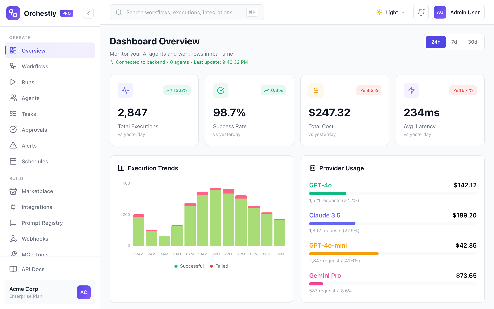
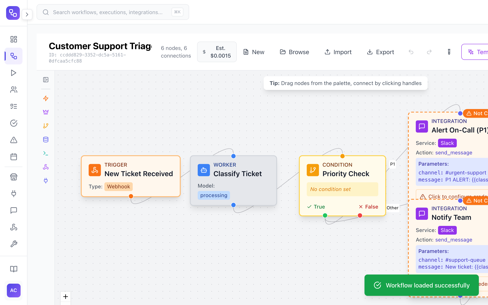
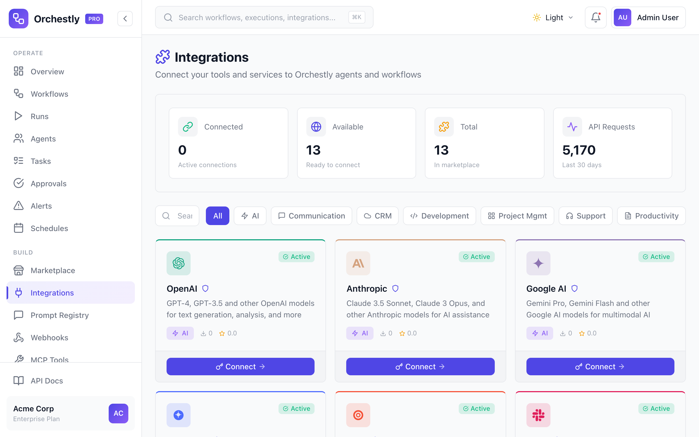
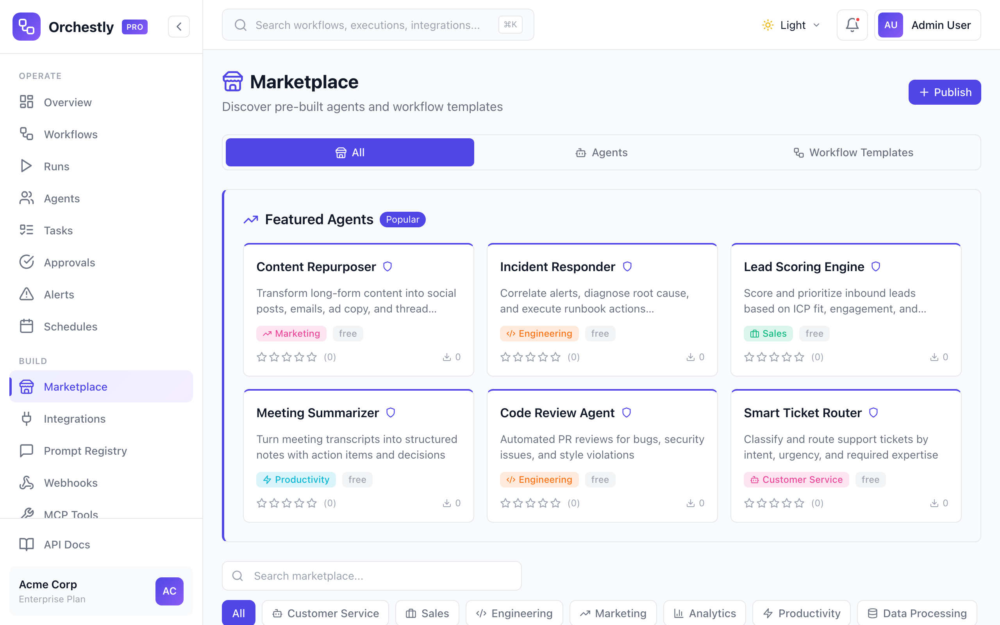
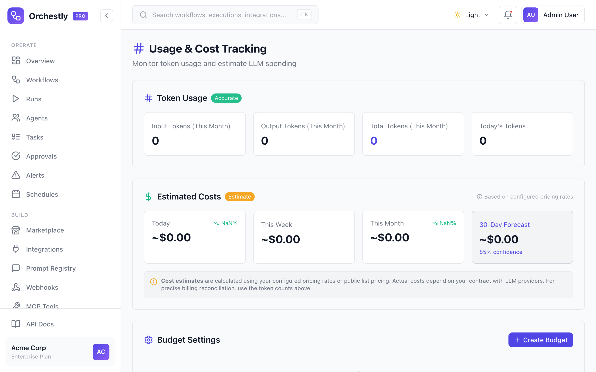

# Orchestly

[](https://github.com/orchestly-ai/platform/actions/workflows/ci.yml)
[](LICENSE)
[](https://github.com/orchestly-ai/platform)
[](https://discord.gg/orchestly)
[](https://github.com/orchestly-ai/platform/discussions)

**Open-source orchestration platform for AI agents.**

Orchestly lets you register, route, monitor, and govern AI agents across your organization. Connect any LLM, build multi-step workflows, and ship reliable AI applications — all from a single dashboard.

## Dashboard Preview

<p align="center">
  
</p>

<details>
<summary><strong>More screenshots</strong></summary>
<br>

**Workflow Designer** — Visual drag-and-drop workflow builder with triggers, conditions, and integrations

<p align="center">
  
</p>

**Integrations** — Connect 20+ services including OpenAI, Anthropic, Slack, GitHub, and more

<p align="center">
  
</p>

**Agent Marketplace** — Discover and install pre-built agents and workflow templates

<p align="center">
  
</p>

**Usage & Cost Tracking** — Monitor token usage and estimate LLM spending across providers

<p align="center">
  
</p>

</details>

## Features

- **Agent Registry** — Register and manage agents across frameworks (LangChain, CrewAI, AutoGen, custom)
- **Workflow Builder** — Visual drag-and-drop workflow designer with branching, loops, and error handling
- **Smart LLM Router** — Route requests across OpenAI, Anthropic, Google, Groq, and more with cost/latency/quality optimization
- **A/B Testing** — Experiment with different LLM configurations and measure real user satisfaction
- **Prompt Registry** — Version-controlled prompt templates with rendering and analytics
- **RBAC & Multi-Tenancy** — Fine-grained permissions, roles, and organization isolation
- **Cost Management** — Track spend per agent, team, and workflow with budget alerts
- **Audit Logs** — Full audit trail for compliance (SOC 2, HIPAA-ready)
- **Human-in-the-Loop** — Approval workflows for sensitive agent actions
- **Integrations Marketplace** — Pre-built connectors for Slack, GitHub, Jira, Salesforce, and 20+ services
- **Real-time Monitoring** — Live metrics, alerts, and agent health dashboards

## Open-Core Model

Orchestly follows an **open-core** model. The core platform is Apache 2.0 and fully featured for building production AI agent workflows. Enterprise features for compliance, governance, and advanced deployment require a license.

| | Community (Apache 2.0) | Enterprise |
|---|---|---|
| Workflow engine & visual designer | ✅ | ✅ |
| Agent registry & management | ✅ | ✅ |
| All integrations (400+) | ✅ | ✅ |
| Smart LLM routing (all providers) | ✅ | ✅ |
| Cost tracking & budget alerts | ✅ | ✅ |
| Prompt registry & versioning | ✅ | ✅ |
| Scheduler (cron/interval) | ✅ | ✅ |
| RAG, Memory, MCP | ✅ | ✅ |
| Basic RBAC (admin/member/viewer) | ✅ | ✅ |
| JWT + API key auth | ✅ | ✅ |
| Human-in-the-Loop (basic) | ✅ | ✅ |
| Webhooks & realtime updates | ✅ | ✅ |
| BYOK (Bring Your Own LLM Keys) | ✅ | ✅ |
| Marketplace (browse & install) | ✅ | ✅ |
| Up to 5 users, 50 agents, 100 workflows | ✅ | ✅ |
| SSO / SAML / OIDC | | ✅ |
| HIPAA compliance | | ✅ |
| Advanced audit (export, retention) | | ✅ |
| Custom RBAC (custom roles) | | ✅ |
| A/B testing (statistical significance) | | ✅ |
| Time-travel debugging | | ✅ |
| ML-based auto-optimization | | ✅ |
| Multi-cloud deployment | | ✅ |
| BYOC (customer VPC workers) | | ✅ |
| White-label & partner program | | ✅ |
| Advanced analytics & BI | | ✅ |
| Security scanning | | ✅ |
| Marketplace (paid publishing) | | ✅ |
| Unlimited users, agents, workflows | | ✅ |

To activate enterprise features, set `ORCHESTLY_LICENSE_KEY` in your environment. See [`ee/README.md`](ee/README.md) for details.

## Quick Start

### Option 1: Run locally (no Docker needed)

```bash
git clone https://github.com/orchestly-ai/platform.git orchestly
cd orchestly

# Set up Python virtual environment
python3 -m venv venv
source venv/bin/activate   # On Windows: venv\Scripts\activate
pip install -r backend/requirements.txt

# Start the API (uses SQLite — no Postgres required)
ADMIN_PASSWORD=admin123 USE_SQLITE=true \
  python -m uvicorn backend.api.main:app --reload
```

Open [http://localhost:8000/docs](http://localhost:8000/docs) for the Swagger UI.

Login: `admin@example.com` / `admin123`

To run the **dashboard** (separate terminal):

```bash
cd dashboard
npm install
npm run dev
```

Open [http://localhost:3000](http://localhost:3000) for the dashboard.

**Populate with demo data** (optional — fills the dashboard with sample workflows, integrations, and agents):

```bash
./scripts/seed-demo-data.sh
```

### Option 2: Docker Compose

```bash
git clone https://github.com/orchestly-ai/platform.git orchestly
cd orchestly
cp .env.example .env
docker compose up
```

This starts PostgreSQL, Redis, the API at `localhost:8000`, and the dashboard at `localhost:3000`.

Login: `admin@example.com` / `admin123` — then run `./scripts/seed-demo-data.sh` to populate with sample data.

### Register your first agent

```python
import requests

resp = requests.post("http://localhost:8000/api/v1/agents/register", json={
    "name": "My Agent",
    "framework": "langchain",
    "capabilities": ["summarization", "qa"],
})
print(resp.json())
```

## Your First Workflow

Create and execute a simple ticket classifier workflow using the REST API:

```python
import requests

BASE = "http://localhost:8000/api/v1"
HEADERS = {"Authorization": "Bearer <your-jwt-token>"}

# 1. Create a workflow
wf = requests.post(f"{BASE}/workflows", json={
    "name": "Ticket Classifier",
    "description": "Classify incoming support tickets by priority",
    "steps": [
        {
            "name": "classify",
            "type": "llm",
            "config": {
                "provider": "openai",
                "model": "gpt-4o-mini",
                "prompt": "Classify this support ticket as low, medium, or high priority:\n\n{{input.ticket_text}}"
            }
        }
    ]
}, headers=HEADERS)
workflow_id = wf.json()["id"]

# 2. Execute the workflow
result = requests.post(f"{BASE}/workflows/{workflow_id}/execute", json={
    "input": {"ticket_text": "My production server is down and customers cannot access the app"}
}, headers=HEADERS)
print(result.json())
```

## Examples

Ready-to-run examples to get you started:

- **[Customer Support Bot](examples/customer-support/)** — Multi-step workflow with agent handoff and human approval
- **[Programmatic Workflow](examples/create_workflow_programmatically.py)** — Create and execute workflows via the Python API

## Architecture

```
orchestly/
├── backend/           # FastAPI + SQLAlchemy async
│   ├── api/           # REST API routes
│   ├── shared/        # Business logic & services
│   ├── database/      # Models & session management
│   └── tests/         # pytest test suite
├── dashboard/         # React + Vite + TypeScript
│   ├── src/
│   │   ├── pages/     # Page components
│   │   ├── components/# Reusable UI components
│   │   └── services/  # API client
│   └── package.json
└── docker-compose.yml
```

- **Backend**: Python 3.9+, FastAPI, SQLAlchemy 2.0 (async), aiosqlite (dev) / asyncpg (prod)
- **Frontend**: React 18, TypeScript, Vite, TailwindCSS
- **Auth**: JWT with RBAC, optional SSO/SAML

## Configuration

Copy `.env.example` to `.env` and configure:

```bash
# Database (SQLite for dev, PostgreSQL for prod)
DATABASE_URL=sqlite+aiosqlite:///./orchestly.db

# LLM Providers (add your keys)
OPENAI_API_KEY=
ANTHROPIC_API_KEY=
GROQ_API_KEY=

# Auth
JWT_SECRET_KEY=           # Generate with: python3 -c "import secrets; print(secrets.token_urlsafe(48))"
ADMIN_PASSWORD=
```

See [`.env.example`](.env.example) for all available configuration options.

## Development

```bash
# Backend (from project root)
python3 -m venv venv && source venv/bin/activate && pip install -r backend/requirements.txt
USE_SQLITE=true python -m uvicorn backend.api.main:app --reload

# Frontend (separate terminal)
cd dashboard && npm install && npm run dev
```

Run tests:

```bash
USE_SQLITE=true PYTHONPATH=. python -m pytest backend/tests/
```

## Roadmap

See [ROADMAP.md](ROADMAP.md) for what's coming next. For past releases, see [CHANGELOG.md](CHANGELOG.md).

## Getting Help

- **[GitHub Discussions](https://github.com/orchestly-ai/platform/discussions)** — Ask questions, share ideas, show what you've built
- **[Discord](https://discord.gg/orchestly)** — Chat with the community and contributors
- **[Issues](https://github.com/orchestly-ai/platform/issues)** — Report bugs or request features
- **Email** — hello@orchestly.ai

For detailed architecture, see [`docs/architecture.md`](docs/architecture.md).

## Contributing

We welcome contributions! See [CONTRIBUTING.md](CONTRIBUTING.md) for guidelines.

## Security

Found a vulnerability? See [SECURITY.md](SECURITY.md) for our responsible disclosure policy.

## License

Apache License 2.0 — see [LICENSE](LICENSE).
